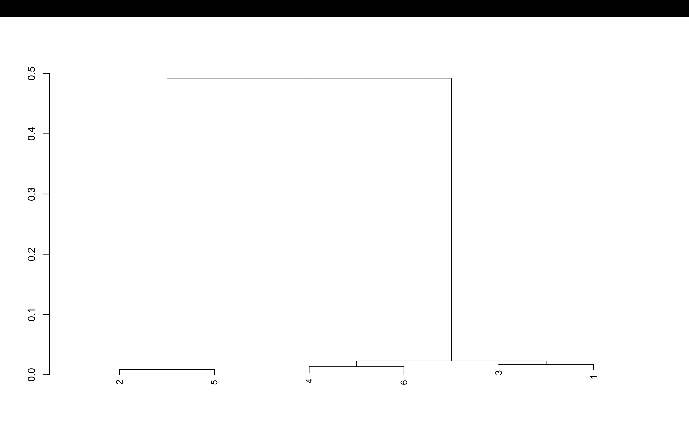

# BIO 410 Final Project
## Background
The data consist of 6 samples from the Ebola virus. This organism is a negative-sense single-stranded RNA virus in the Filoviridae family which causes Ebola virus disease [citation].

## Purpose
The purpose of this project was to create a phylogenetic tree from 6 samples of ebola virus in order to determine the evolutionary relationships between the samples.

## Methods
The six samples were analyzed using next-generation sequencing (NGS) reads. The raw sequencing reads are located in the hamza/ folder, which contains the paired .fq files for the six samples. These reads were assembled using MEGAHIT, an ultra-fast and memory-efficient NGS assembler. The assembled reads are located in the t1_out/, t2_out/, t3_out/, t4_out/, t5_out/, and t6_out/ folders, and each folder contains an assembled contig file called final.contigs.fa. The assembled contigs were then loaded into R using Biostrings and aligned with the AlignSeqs() function from the DECIPHER package. The alignment output was saved as Hamza's Final Project.html. The phylogenetic tree was then created in R using the maximum likelihood (ML) method with DECIPHER’s Treeline() function, which builds trees from aligned nucleotide or amino acid sequences.

## Results

Here is the phylogenetic tree:
(Insert the image, see the markdown cheat sheet for how to do that)

Based on the phylogenetic tree, samples 2 and 5 are the most closely related, samples 4 and 6 are closely related, and samples 3 and 1 are closely related. Since the six samples group into three close pairs, the samples most likely came from three individuals total
